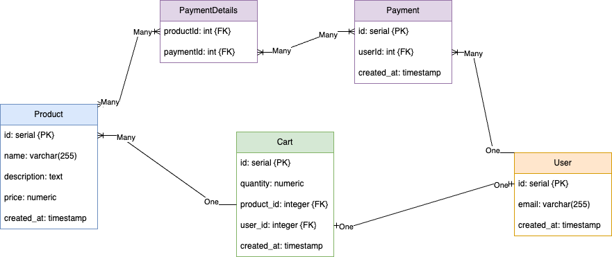

# Spring Boot Lesson

## Quick Start

To run the project:

Step 1: CD to the project root directory `cart_api`

Step 2: Run `./mvnw spring-boot:run` command

## Lesson Overview (9 Mar 2023, Fri)

Lesson Coverage:

1. Move complex logics in `/carts` to a `@Service` class
2. Adding `User` entity
3. Use of `UserID` header as a mock authentication header

> Firebase SDK has a major shift and no longer support `signInWithEmailAndPassword` from the backend `Firebase Admin SDK` using Java.

## 1. Move complex logics to @Service class

Refer to the `add` and `decrement` methods in [CartService.java](./cart_api/src/main/java/sg/edu/ntu/cart_api/service/CartService.java) where complex logics is moved into.

Refer to [CartController.java](./cart_api/src/main/java/sg/edu/ntu/cart_api/controller/CartController.java) where the code mainly focuses on handling http request and response (status).

A custom exception called [NotFoundException.java](./cart_api/src/main/java/sg/edu/ntu/cart_api/exception/NotFoundException.java) is created to help us identify scenario where the `productId` is not found.

## 2. Adding the `User` Entity

Let's refer to our ERD again while creating our `User` Entity class.



The SQL Statements required to generate the `user` table:

```sql
create table user (
    id int not null auto_increment,
    email varchar(255) not null,
    created_at timestamp not null default current_timestamp,
    primary key (id)
);

alter table cart add column user_id int;
alter table cart add constraint fk_cart_user foreign key (user_id) references user(id);
```

If you need to check all foreign keys in the DB, use the following command:

```sql
SELECT TABLE_NAME,COLUMN_NAME,CONSTRAINT_NAME, REFERENCED_TABLE_NAME,REFERENCED_COLUMN_NAME FROM INFORMATION_SCHEMA.KEY_COLUMN_USAGE WHERE REFERENCED_TABLE_SCHEMA = 'cartdb';
```

## 3. Using `@RequestHeader` to capture value from HTTP Header

```java
public ResponseEntity<List<Cart>> findAll(@RequestHeader("user-id") int userId)
```

See [CartController.java](./cart_api/src/main/java/sg/edu/ntu/cart_api/controller/CartController.java) for full details.

We should also implement this for every methods in `CartController.java`. This will eventually affect `CartService.java` as well. All request to `/carts` must contains a `user-id` header.

End
